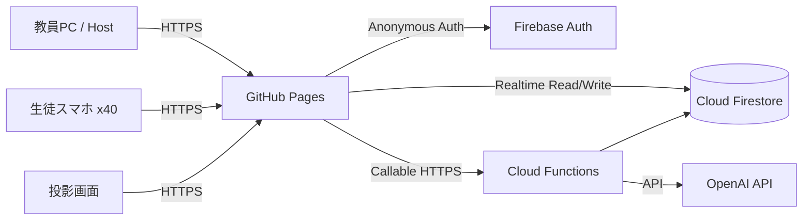

# 歴史鉄道 ～日本をめぐって天下を取れ～

## 1. システムアーキテクチャ

### 結論
40名同時参加・10分完結・教員PC投影・スマホ操作・AI生成を両立するため、以下を推奨する。

- フロントエンド: React + TypeScript + Vite
- UI: CSS Modules + CSS Variables
- リアルタイム同期: Firebase Firestore onSnapshot
- 認証: Firebase Anonymous Authentication
- サーバー処理: Firebase Cloud Functions
- AI生成: OpenAI API（Cloud Functionsからのみ呼び出す）
- 静的公開: GitHub Pages
- サーバー公開: Firebase Functions
- 状態管理: Zustand
- バリデーション: Zod
- テスト: Vitest + React Testing Library

### 理由
1. 生徒40名規模ならFirestoreのリアルタイム購読で十分対応可能。
2. WebSocketサーバーを自前運用するより、授業中の接続安定性と保守性が高い。
3. GitHub Pagesはフロントを無料公開できる。
4. OpenAI APIキーをブラウザへ置かず、Cloud Functionsに隠せる。
5. React + TypeScriptなら教員画面・生徒画面・投影画面を共通部品化しやすい。

## 2. 全体構成



## 3. 画面の役割

### 教員画面 /host
- 新規ゲーム作成
- テーマ・学年・難易度入力
- AI教材生成
- 参加コード表示
- 参加人数確認
- ゲーム開始・一時停止・強制進行
- 現在ターン確認
- 最終問題開始
- リザルト表示

### 投影画面 /screen/:roomCode
- ゲームタイトル
- QRコード・参加コード
- 参加人数
- 現在ターン
- 残り時間
- 目的地
- 到着演出
- 全体事件
- 最終早押し問題
- 最終ランキング・各賞

### 生徒画面 /join/:roomCode
- ニックネーム入力
- 待機
- サイコロ
- マスイベント
- クイズ回答
- 決断
- 物件購入
- 自分の資産・順位・疫病神状態
- 最終早押し
- 個人結果

## 4. ゲーム状態モデル

ゲーム進行は `game.phase` と `game.turn` を唯一の基準にする。

### phase
- lobby
- preparing
- turn_roll
- turn_event
- turn_result
- final_quiz
- result
- ended

### ターン進行
各ターン90秒を厳密に内部工程へ分ける。

- 0-15秒: サイコロ
- 15-65秒: マスイベント
- 65-80秒: 結果反映
- 80-90秒: 次ターン準備

未操作者は時間切れ時に安全側の自動処理を行う。

## 5. 同時進行の設計

40人を順番処理しない。

各プレイヤーが自分の `players/{playerId}` に操作結果を書き込み、Cloud Functionsまたはトランザクションで整合性を確保する。

例:
1. 生徒が「振る」
2. クライアントは `actions/{playerId_turn}` にリクエストを書き込む
3. サーバー側で乱数決定・移動処理
4. player.positionを更新
5. 該当マスのイベントをplayer.pendingEventへ設定
6. 生徒画面がリアルタイム更新

サイコロ値をクライアント側だけで決めない。改ざん防止のためサーバー確定を基本とする。

## 6. 目的地システム

- マップは20〜30マス程度の環状または一本道
- destinationSpaceIdをgameに保持
- プレイヤー移動後に到着判定
- 最初の到着者のみボーナス
- transactionで `destinationClaimedBy` を確定
- 到着後、次候補から新しい目的地を設定

同時到着時はサーバー受付時刻を基準に最初の1名とする。

## 7. 疫病神システム

毎ターン開始時に前ターン終了時点の総資産最下位へ付与。

保持項目:
- plague.active
- plague.type
- plague.penalty

候補効果:
- money_loss: ターン開始時 -5000
- dice_minus_one: サイコロ結果 -1（最低1）

救済:
- 疫病神付きプレイヤーがクイズ正解 → 即解除
- 疫病神付きかつ最下位 → クイズ賞金2倍

## 8. 最終早押し

公平性確保のため、ブラウザの表示時刻ではなくサーバー基準時刻を利用する。

保存:
- finalQuiz.startedAt
- answers/{playerId}.submittedAt
- answers/{playerId}.answer
- answers/{playerId}.correct

速度順位は `submittedAt - startedAt` で計算。

ボーナス例:
- 正解: +10000
- 速度1位: +30000
- 速度2位: +20000
- 速度3位: +10000

## 9. AI生成

### 入力
- subject: 日本史 / 世界史 / 地理 / 公民
- grade: 中学生 / 高1 / 高2 / 高3
- difficulty: 易しい / 標準 / 難しい
- theme: 自由入力

### 出力JSON
```json
{
  "title": "幕末・明治維新編",
  "quizzes": [],
  "events": [],
  "properties": [],
  "destinations": [],
  "spaces": []
}
```

### 安全設計
- OpenAI APIはCloud Functionsのみ
- JSON Schemaで出力形式固定
- Zodで検証
- 不正JSON時は最大2回再生成
- 金額レンジ、選択肢数、正解番号をサーバー側で再検証

## 10. GitHub Pages公開方針

フロントは `/history-railway/` 配下で動作させる。

Vite設定:
```ts
export default defineConfig({
  base: '/nakamahadaiji/history-railway/'
})
```

ただし現在のリポジトリ名が `nakamahadaiji` のため、Pages URL構成に応じて最終調整する。

## 11. 実装ステップ

### Phase 1: 動く土台
- React/Vite初期化
- ルーティング
- Host / Screen / Join画面
- Firebase接続
- ルーム作成・参加

### Phase 2: コアループ
- 5ターン
- サイコロ
- 移動
- 6種イベント
- 90秒進行

### Phase 3: 特殊ルール
- 目的地
- 疫病神
- 物件
- 全体事件

### Phase 4: 最終問題・表彰
- 最終早押し
- 資産計算
- 5種表彰

### Phase 5: AI生成
- Functions
- OpenAI API
- JSON Schema
- 教員生成UI

### Phase 6: 授業用仕上げ
- 40名負荷試験
- 再接続
- タイムアウト
- 投影演出
- GitHub Pages CI
