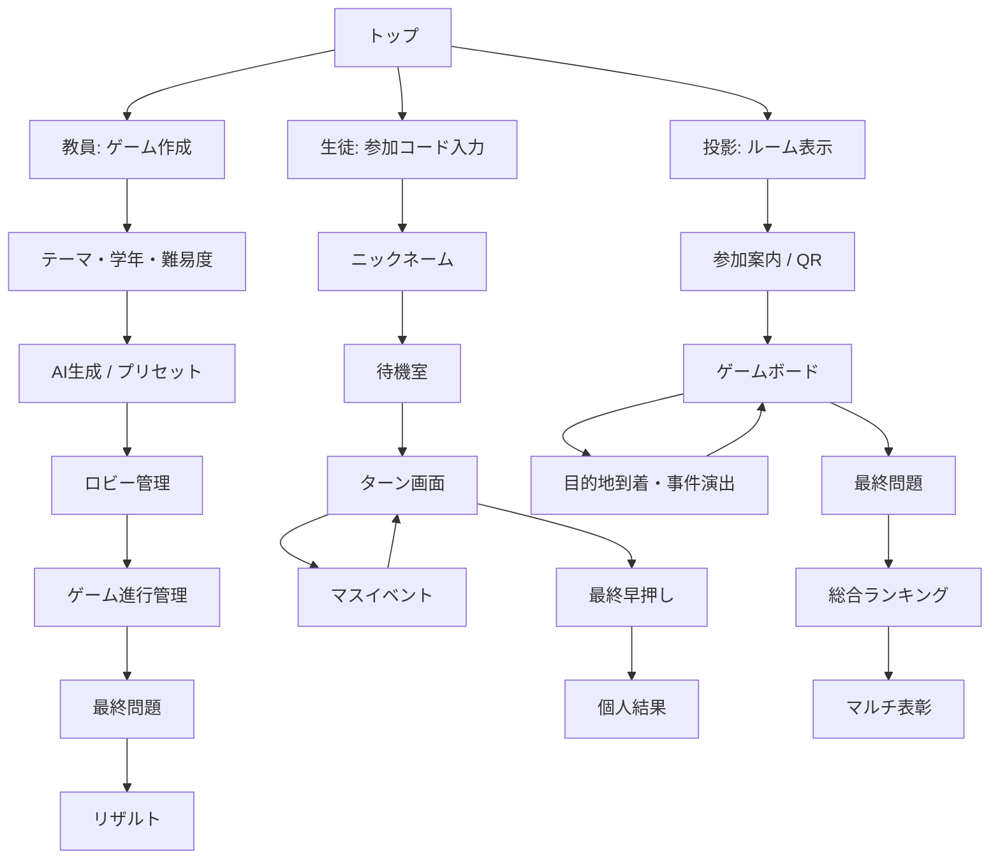

# 画面遷移図

## 全体



## 教員画面

```mermaid
flowchart LR
  A[/host] --> B[ゲーム設定]
  B --> C{教材生成}
  C -->|AI| D[生成内容プレビュー]
  C -->|プリセット| D
  D --> E[ルーム作成]
  E --> F[ロビー]
  F --> G[ゲーム開始]
  G --> H[ターン1]
  H --> I[ターン2]
  I --> J[ターン3]
  J --> K[ターン4]
  K --> L[ターン5]
  L --> M[最終問題]
  M --> N[結果]
```

## 生徒画面

```mermaid
flowchart LR
  A[/join] --> B[コード入力]
  B --> C[名前入力]
  C --> D[待機]
  D --> E[サイコロ]
  E --> F{停止マス}
  F --> G[利益/損失]
  F --> H[クイズ]
  F --> I[決断]
  F --> J[物件]
  F --> K[事件]
  G --> L[ターン完了]
  H --> L
  I --> L
  J --> L
  K --> L
  L -->|次ターン| E
  L -->|5ターン終了| M[最終早押し]
  M --> N[結果]
```

## 生徒ターン画面の情報優先順位

スマホでは情報量を絞る。

1. 上部: TURN 3/5、残り秒数
2. 資産: 所持金 / 総資産 / 暫定順位
3. 現在地 → 目的地
4. メイン操作ボタン
5. イベントカード
6. 下部: 所持物件、クイズ成績、疫病神

## 投影画面の情報優先順位

1. 現在ターン・残り時間
2. 日本列島風のルート / 全員の位置分布
3. 現在の目的地
4. 上位5名の暫定ランキング
5. 最新イベントフィード
6. 到着・事件時のみ全面演出

## 到着演出

通常画面
↓
全画面暗転 0.3秒
↓
「目的地到着！」
↓
「前岡さん → 京都」
↓
「+20,000両」
↓
次の目的地発表
↓
通常画面へ

演出全体は3〜4秒以内とし、10分授業を圧迫しない。

## 結果画面

総合ランキングを先に3〜5秒表示し、その後に称号を横並びまたは順番に表示する。

- 総合優勝
- クイズ王
- 大地主
- 豪運王
- 波乱王

同率の場合は複数受賞を許可する。総合順位だけで終わらせず、下位プレイヤーにも表彰機会を作る。
